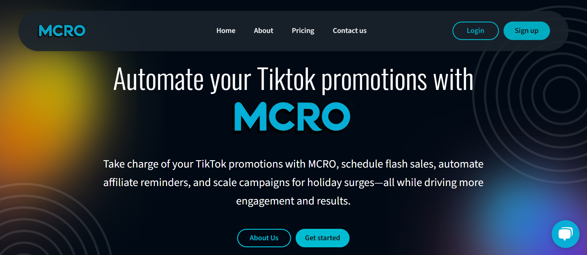
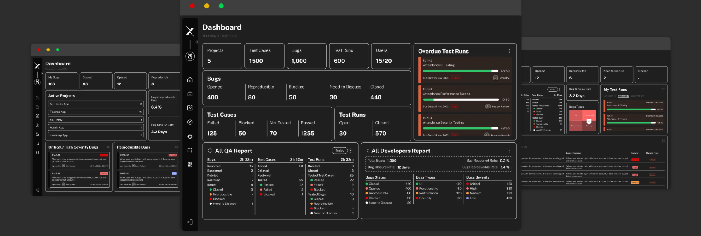
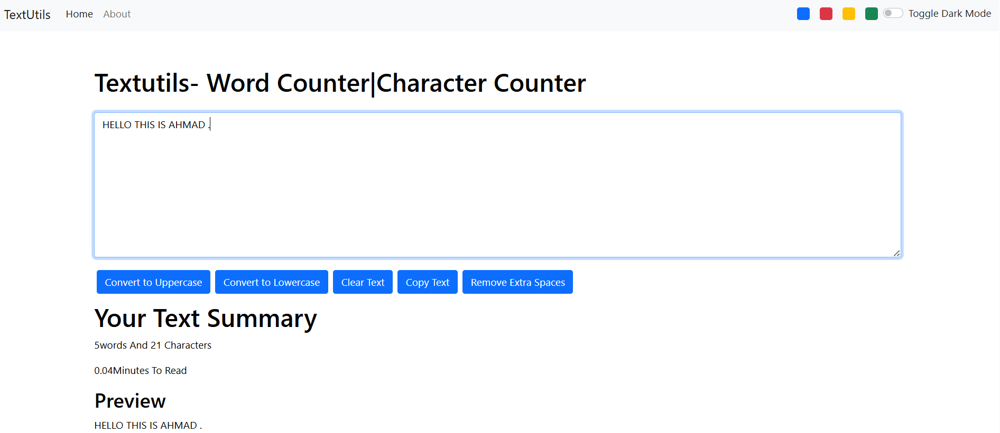

This repository showcase my different projects and designs UI. The projects are built using the following stacks.

JavaScript (JS)
Next.js
React.js
HTML
CSS
SCSS
Tailwind CSS
Express
MongoDB
WordPress 

🌐 Projects Links & Screenshots
Here is a some of my projects with live links and screenshots:

1. MCRO AI
Description: MCRO is more than just a tool—it’s our passion project. We’ve designed it to make your life easier by helping you manage your TikTok promotions, affiliates, and strategies without all the usual headaches. We’re all about giving you the tools you need to scale, collaborate, and crush it online.

Stack: React, Tailwind CSS, MongoDB, NextJs etc.
Live Website: [Project 1 Live Link](https://mcro.ai/)

2. Agency Consultation
Description: Do More with Agency.

Stack: HTML, CSS, SCSS, JS, Express, etc.
Live Website: [Project 2 Live Link](https://agencymarket.netlify.app/)

3. Crosscheck
Description: We created a centralized test management tool that covers test case management, test runs, bug reporting, and tracking, complete with insightful dashboards and a free DevTools Extension. By fostering Agile and Quality Driven Development principles, we ensure everything is cross-checked during software testing in one platform.

Stack: ReactJs, MongoDB, SCSS, NodeJs.

3. TextCounter PlayGround
Description:Edit your Text with your own style.

Stack: ReactJs, CSS

📝 License
Distributed under the MIT License. See LICENSE for more information.
